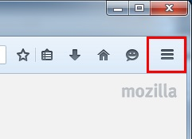

How to Test
===

## Firefox

### Prepare

* Put firefox/autoconfig.js to [installation directory]\default\pref
* Put firefox/autoconfig.cfg to [installation directory]

### Expected result

* Show red border arround ≡(#PanelUI-menu-button)

## Thunderbird

### Prepare

* Put thunderbird/autoconfig.js to [installation directory]\default\pref
* Put thunderbird/autoconfig.cfg to [installation directory]

### Expected result

* Show red border arround ≡(#button-appmenu)

